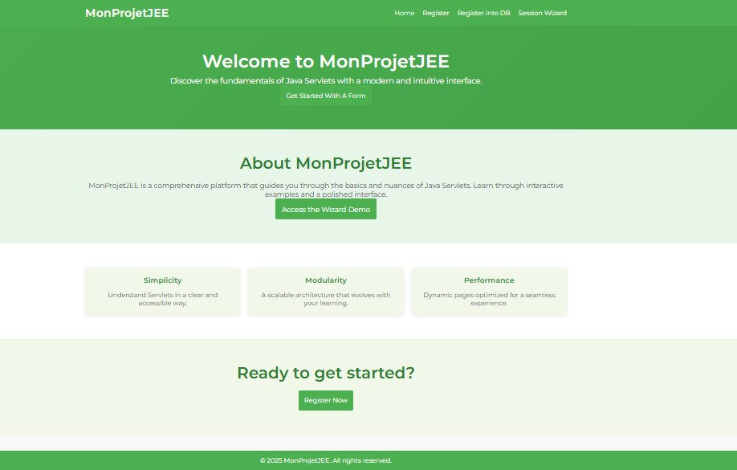
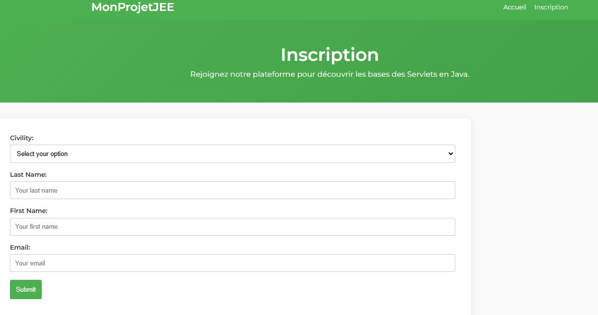
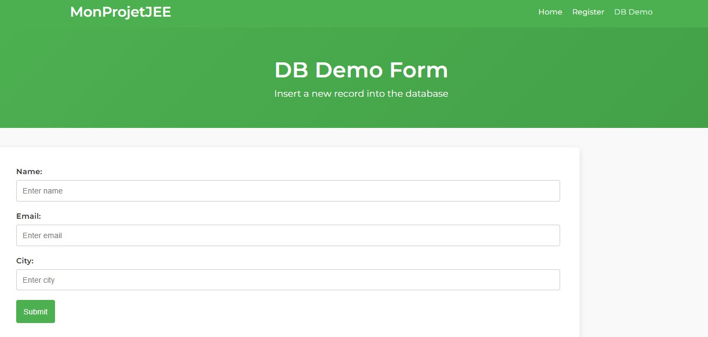
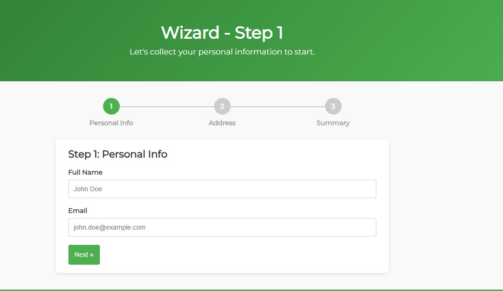
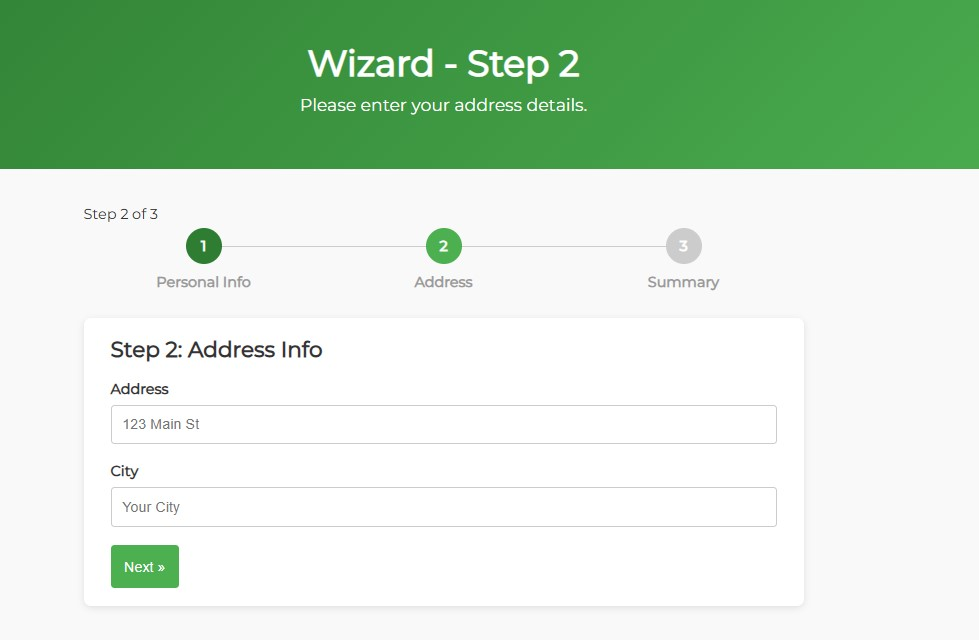
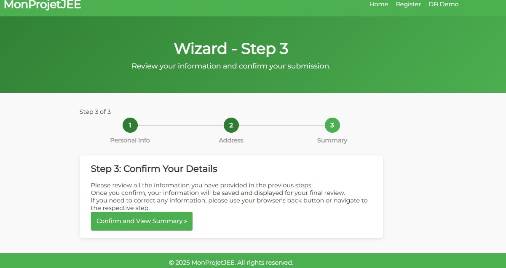

# 🌐 ServletJourney - Multi-Step Wizard Web Application

**ServletJourney** est une application web éducative qui illustre de manière moderne et interactive l'utilisation avancée des **Servlets Java EE**, de la gestion des **sessions HTTP**, et de l'intégration avec une base de données grâce à JDBC. Ce projet met en pratique les fondamentaux du développement Java EE dans une structure ergonomique et attrayante.

---

## 🎯 Objectifs du projet

- Comprendre le cycle de vie des Servlets (init, doGet/doPost, destroy).
- Gérer des sessions HTTP pour conserver des données utilisateur sur plusieurs pages.
- Utiliser JDBC pour la persistance des données.
- Concevoir une interface utilisateur claire et moderne grâce à CSS et Bootstrap.
- Implémenter une gestion des erreurs personnalisée.

---

## 🛠️ Technologies utilisées

- **Java EE (Servlet API)**
- **Apache Tomcat 10.1.34**
- **MySQL avec JDBC**
- **HTML5, CSS3 personnalisé, Bootstrap 5**
- **IntelliJ IDEA ou Eclipse**

---

## 📂 Structure du projet

```
ServletJourney
├── src/main/java/com/example/sessions/
│   ├── Step1Servlet.java
│   ├── Step2Servlet.java
│   └── SummaryServlet.java
│
├── src/main/webapp
│   ├── index.html
│   ├── Form.html
│   ├── dbForm.html
│   ├── Step1.html
│   ├── Step2.html
│   ├── Step3.html
│   ├── NombreIncorrect.html
│   ├── ErreurServeur.html
│   └── WEB-INF/web.xml
│
├── screenshots (captures d'écran ici)
└── pom.xml
```

---

## 🚀 Démarrage rapide

### 1️⃣ Clonez le dépôt

```bash
git clone https://github.com/RAZIMOUAD/ServletJourney.git
```

### 2️⃣ Configurer la base de données

```sql
CREATE DATABASE monprojet;
USE monprojet;

CREATE TABLE persons (
    id INT AUTO_INCREMENT PRIMARY KEY,
    name VARCHAR(100),
    email VARCHAR(100),
    city VARCHAR(100)
);
```

### 3️⃣ Déploiement avec Apache Tomcat

- Importez le projet dans IntelliJ IDEA ou Eclipse.
- Lancez Tomcat 10.1.34.
- Rendez-vous sur :

```
http://localhost:8080/ServletJourney/index.html
```

---

## 📸 Captures d'écran














---

## 📌 Gestion des erreurs

Configuration du fichier `web.xml` :

```xml
<error-page>
    <exception-type>java.lang.NumberFormatException</exception-type>
    <location>/NombreIncorrect.html</location>
</error-page>

<error-page>
    <error-code>500</error-code>
    <location>/ErreurServeur.html</location>
</error-page>
```

---

## 📚 Ressources utiles

- [Servlet API](https://jakarta.ee/specifications/servlet/)
- [Documentation Tomcat](https://tomcat.apache.org/)
- [Bootstrap 5](https://getbootstrap.com/docs/5.3/getting-started/introduction/)

---

## 🚧 Prochaines améliorations

- Sécurité avancée
- Authentification utilisateur
- Tests automatisés avec JUnit

---

## 👨‍💻 Auteur

** MOUAD RAZI**  
Étudiant ingénieur en Génie Informatique (ENSA Marrakech)    
🔗 [GitHub](https://github.com/RAZIMOUAD)

---

🎉 **Bon apprentissage et bon codage !**

